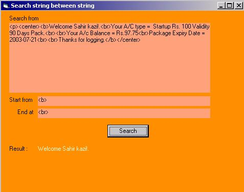



## search in  between string

### Description

example shows how to search particular string between twon defined strings
 
### More Info
 

             |
---                |---
**Submitted On**   |2003-04-25 18:10:40
**By**             |[Sahir ](https://github.com/Planet-Source-Code/PSCIndex/blob/master/ByAuthor/sahir.md)
**Level**          |Intermediate
**User Rating**    |5.0 (10 globes from 2 users)
**Compatibility**  |VB 4\.0 \(32\-bit\), VB 5\.0, VB 6\.0
**Category**       |[String Manipulation](https://github.com/Planet-Source-Code/PSCIndex/blob/master/ByCategory/string-manipulation__1-5.md)
**World**          |[Visual Basic](https://github.com/Planet-Source-Code/PSCIndex/blob/master/ByWorld/visual-basic.md)
**Archive File**   |[search\_in\_1579754262003\.zip](https://github.com/Planet-Source-Code/sahir-search-in-between-string__1-45054/archive/master.zip)

